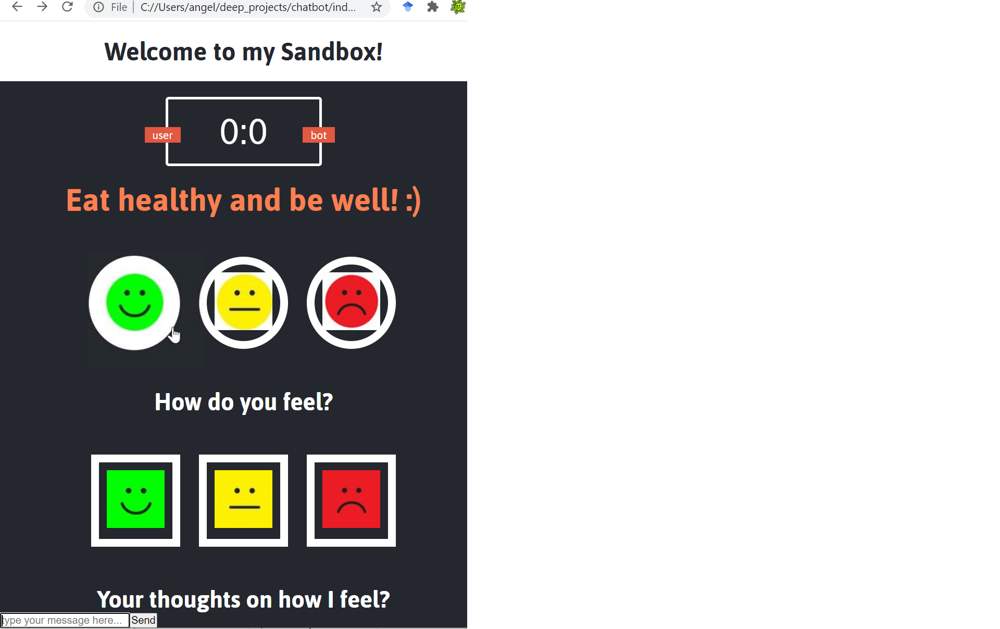

# Sandbox-Chatbot
The objective is to create an interactive webpage where my "Sandbox Chatbot" will respond when you talk and play "guess your mood" with you. With the guessing game, the user and chatbot can guess each other's mood.  Correct guesses earn 1 point and incorrect ones grant the opponent 1 point.  The chatbot's "mood" is assigned based on analysis of the user's intent and sentiment.

Although functions and logic are not at a workable state yet, below is the current interface with chat input on the bottom left corner:

## Checkpoint 1: Interface setup (in progress)
*Explore html, css, JavaScript* 

The first bite-sized objective is to set up the general interface and a watered-down "guess your mood" game. The bot will randomly guess your mood, and its mood is randomly assigned.

## Checkpoint 2: Chat and feedback setup (in progress)
*Explore Node.js and Vue.js* 

The chat function implementation: user can input strings for processing and a response will be displayed (hard-coded for starters).

## Checkpoint 3: NLP
*Explore natural* 

The natural language processing aspect of the chatbot will be incorporated, where the strings are analyzed for sentiment (the bot's "guess" of the user's mood, which can earn the bot points for getting it correct) and intent (which will be mapped to the bot's "mood" that the user can guess).
